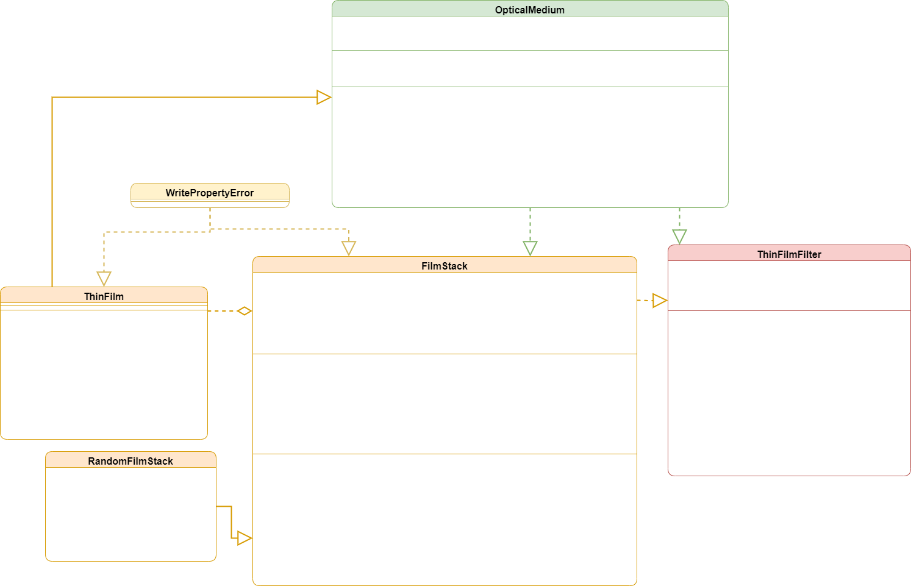

# Introduction
The Thin Film Filter library contains a collection of physical abstractions
of real-world optical materials used in making a thin-film optical filter.
A thin-film optical filter typically consists of a substrate material,
a stack of thin film layers, and an incident medium. The objects found in this
library offer a software API which mimics real-world behavior of optical
materials used in thin-film production.

# Installation
1. In a directory of your choice, create a new python environment
```console
$ python -m venv env
```

2. Activate the environment with the following command:
```console
Linux/Mac:
$ source ./env/bin/activate

Windows:
$ ./env/Scripts/activate
```

2.	install tff_lib in the newly activated python environment:
```console
(env)$ python -m pip install git+https://ThorlabsSpectralWorks@dev.azure.com/ThorlabsSpectralWorks/Python%20Packages/_git/tff-lib
```
3.	tff_lib requires python >= 3.10

# Getting Started
To begin using tff_lib, import tff_lib just like any other python library, and start exploring the features. Below are some examples of common use cases.
```python
from tff_lib import ThinFilm, FilmStack

thick = 500                         # thickness in nanometers
mat = 1                             # high index material type
wvls = [400, 500, 600, 700, 800]    # wavelengths in nanometers
idx = [2, 2, 2, 2, 2]               # refractive indices at each wvl

# create a high-index ThinFilm object
film1 = ThinFilm(wvls, idx, thick=thick, ntype=mat)

# create a low-index ThinFilm object
film2 = ThinFilm(wvls, idx*0.5, thick=thick, ntype=0)

# create a stack of thin films
# which alternate high index
# and low index films
stack = FilmStack([film1, film2])
```

# Design Principles
The class diagram below shows the basic structure of tff_lib. tff_lib provides interfaces
to most of the common elements used in a thin-film optical filter design, including
ThinFilm, FilmStack, ThinFilmFilter, and OpticalMedium. OpticalMedium is fully implemented in C/C++ as an extension object and wrapped in a Python class to provide access to docstrings and type-hinting. Additionally, tff_lib provides a RandomFilmStack which can be used in some exhaustive search optimization applications. There is also a custom error class, WritePropertyError which is used to safeguard read-only class properties.



# Reference
[UML Wiki](https://en.wikipedia.org/wiki/Unified_Modeling_Language)

[UML Class Diagrams](https://www.visual-paradigm.com/guide/uml-unified-modeling-language/uml-class-diagram-tutorial/)

[NumPy](https://numpy.org/)

[SciPy](https://scipy.org/)

[Thin-film Optics](https://en.wikipedia.org/wiki/Thin-film_optics)

[Thin-film interference](https://en.wikipedia.org/wiki/Thin-film_interference)